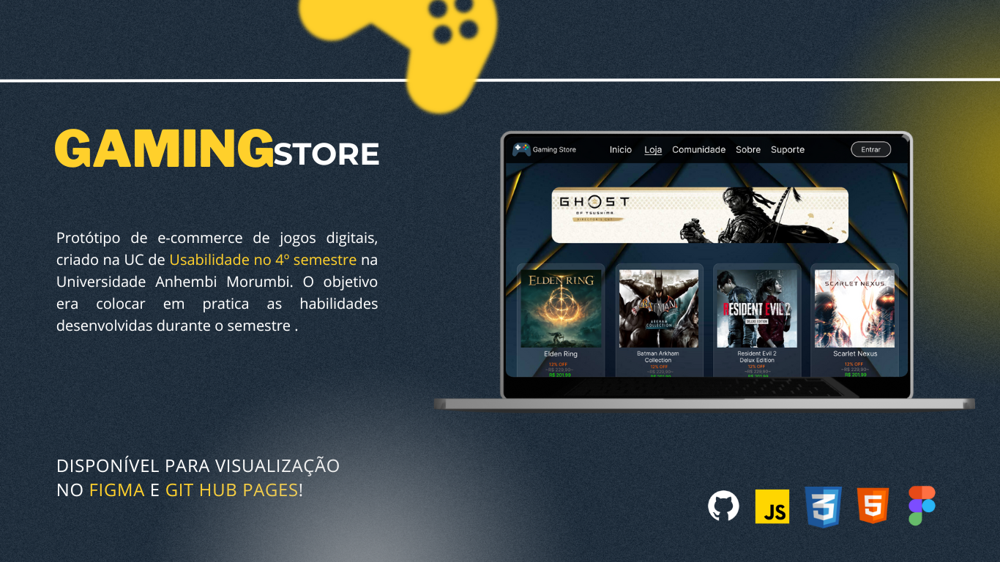
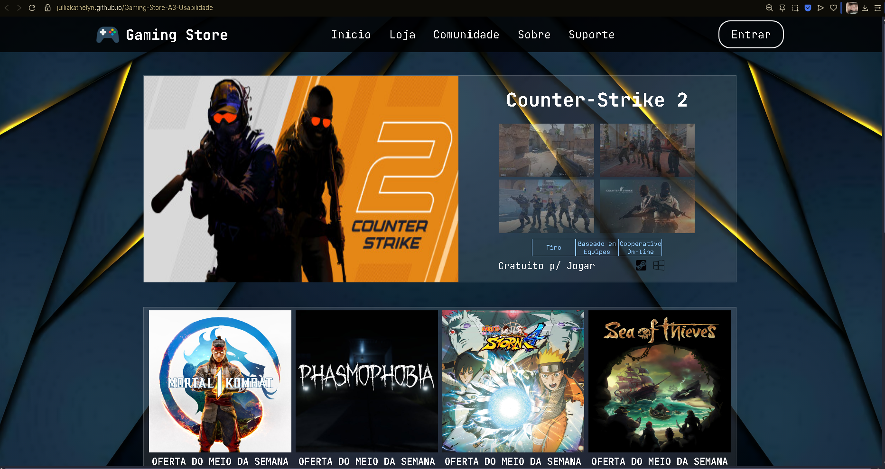
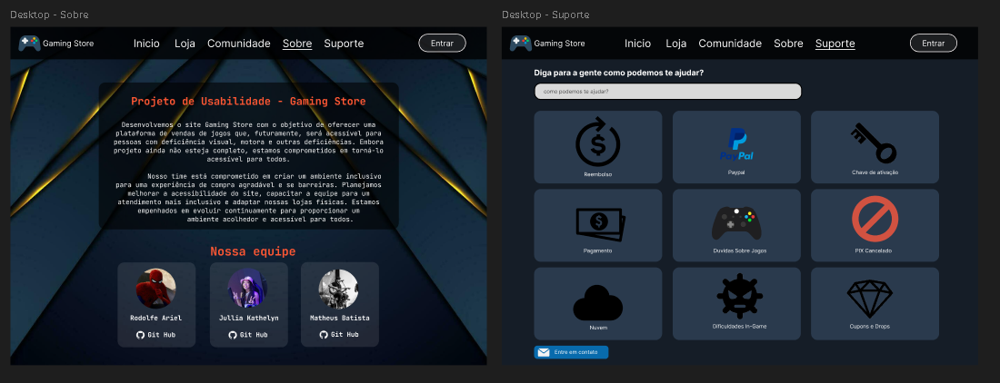
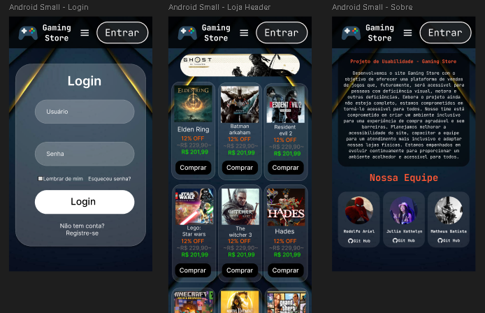

# 🎮 Gaming Store  



Um **e-commerce de jogos digitais**, desenvolvido como projeto da UC de **Usabilidade** no **4º semestre da Universidade Anhembi Morumbi** .
O objetivo foi colocar em prática as habilidades adquiridas durante o semestre, unindo conceitos de design de interfaces, usabilidade e desenvolvimento web.  

- [GitHub Pages - Gaming Store ](https://www.youtube.com/playlist?list=PL2Fdisxwzt_cajoGVWTx44wM6Ht09QJ3A)

---

## 📌 Sobre o Projeto  


O **Gaming Store** é uma aplicação web que simula uma loja de jogos digitais, oferecendo páginas de cadastro, login, catálogo de jogos, comunidade e suporte.  

Foi desenvolvido utilizando:  

- **HTML5** → Estrutura das páginas  
- **CSS3** → Estilização e design responsivo  
- **JavaScript (JS)** → Funcionalidades e interatividade  

# 📸 Protótipo

Além disso, um **protótipo** foi criado previamente para guiar o design e a experiência do usuário.




- [Figma - Gaming Store  ](https://www.figma.com/design/7zf1LrVJH2ZZuAPu1jKzaI/Gaming-Store?node-id=11-2&t=3oZW71Sz6eZY3CsH-1)
  
---

## 📂 Estrutura do Projeto  
- `index.html` → Página inicial  
- `loja.html` → Catálogo de jogos  
- `ghost-game.html` → Página de exemplo de jogo  
- `login.html` → Login de usuário  
- `register.html` → Registro de conta  
- `esqueciSenha.html` → Recuperação de senha  
- `suporte.html` → Página de suporte  
- `comunidade.html` → Espaço para a comunidade  
- `sobre.html` → Informações sobre o projeto  

📁 **Pastas**:  
- `img/` → Imagens utilizadas no site  
- `styles/` → Arquivos de estilo CSS  
- `scripts/` → Arquivos JavaScript  
- `suporteTag/` → Componentes relacionados à área de suporte  
- `.vscode/` → Configurações de ambiente  

---

## 🚀 Como Executar  
1. Clone este repositório:  
   ```bash
   git clone https://github.com/seu-usuario/Gaming-Store.git
   ```

2. Abra o arquivo index.html no navegador de sua preferência.

## 🎯 Objetivo Acadêmico

- Aplicar conceitos de usabilidade;
- Praticar o desenvolvimento de protótipos e sua implementação;
- Aprimorar conhecimentos em HTML, CSS e JavaScript;
- Simular a experiência de navegação em uma loja digital de jogos.

---
